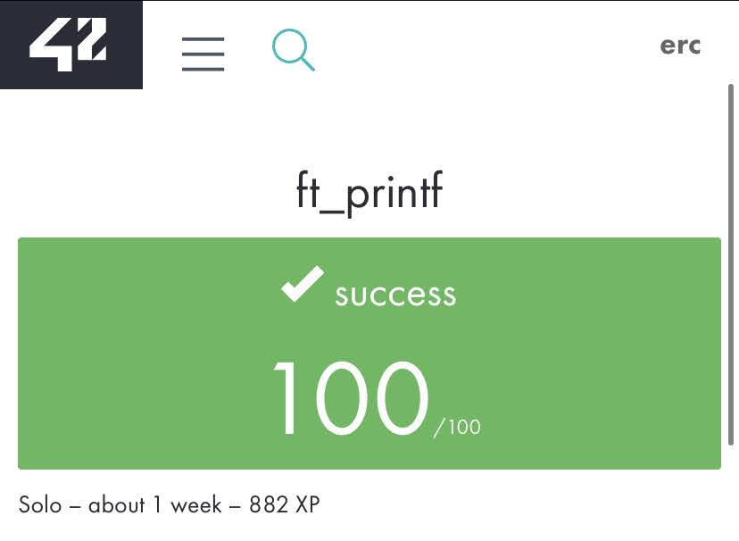

# 
This project is a **recode of libc's 'printf' function** in accordance with the 42 code norm.

## :dart: Subject
You can see the subject **pdf** [here.](https://cdn.intra.42.fr/pdf/pdf/10819/en.subject.pdf)
  * Recode libc's 'printf' function.
  * It manages the following conversion: **cspdiuxX%**
  * It also manages any combination of the following flags: **-0.***
  * Example:
  ```c
    #include "../2.ft_printf/ft_printf.h"
    #include <stdio.h>

    int main(void)
    {
      int num, hex = 20124;
      int *ptr = &num;
      char *str = "EXAMPLE";

      ft_printf("Integer: %d\n", num);
      ft_printf("Hexadecimal: %0*x\n", 10, hex);
      ft_printf("Pointer address: %p\n", ptr);
      ft_printf("String: |%-15s|\n", str);

      return (0);
    }
  ```
  * Output:
  ```
    Integer: 32767
    Hexadecimal: 0000004e9c
    Pointer address: 0x7fff2a63b36c
    String: |EXAMPLE        |
  ```
    
## :wrench: Usage
The makefile creates a library called "libftprintf.a" that contains ft_printf. You can compile a program with "libftprinf.a".
  * Example:
  ```
     make && make clean
     gcc main.c libftprintf.a
  ```
## :beetle: Debugging
[LLDB](https://en.wikipedia.org/wiki/LLDB_(debugger)) is a powerful tool that helped me debug this project, specially the GUI.
Here is how you can run it:
  *    First, modify your makefile so it compiles with '-g3'.
  ```
  	@gcc -g3 -Wall -Wextra -Werror -I$(INCLUDES) -c $(SRCS)
  ```
  *    At compilation time, compile with '-g3' too.
  ```
  gcc -g3 main.c libftprintf.a
  ```
  *    Then run the following command consecutively:
  ```
  lldb a.out
  b main
  run
  gui
  ```
  In the GUI, use 's', 'tab', 'space' & 'o' to explore your program step by step.
## :boxing_glove: Testers
* [Norminette](https://github.com/42sp/norminette-client)
* [Valgrind](https://en.wikipedia.org/wiki/Valgrind)
* [PFT](https://github.com/gavinfielder/pft) by Gavin Fielder
* [42TESTERS-PRINTF](https://github.com/Mazoise/42TESTERS-PRINTF) by Mazoise
* [printf_lover_v2](https://github.com/charMstr/printf_lover_v2) by charMstr
* [PRINTF_TESTER](https://github.com/Kwevan/PRINTF_TESTER) by Kwevan Gouacide
## :books: Resources
I had many sources of information but the main ones would be:
* https://www.cplusplus.com/reference/cstdio/printf/
* https://pubs.opengroup.org/onlinepubs/9699919799/functions/fprintf.html
* https://en.wikipedia.org/wiki/Stdarg.h
* https://en.wikipedia.org/wiki/Printf_format_string
* [This Google Document](https://docs.google.com/document/d/1znc7N5ua3WC1PhGcirRhtadHYSrPK3wxTApMdlJXYes/edit?pli=1#)
## :heavy_check_mark: Moulinette

## :smile: Special Thanks
I want to thank God in the first place for all the special people that helped me through this project:
* [@edithturn](https://github.com/edithturn)
* [@michaelgiraldo](https://github.com/michaelgiraldo)
* [@alineayumi](https://github.com/alineayumi)
* [@piratelicorne](https://github.com/piratelicorne)
* [@geekMe82](https://github.com/geekMe82)
### Thanks so much. It would have been very different without your help.
# **SOLI DEO GLORIA**
